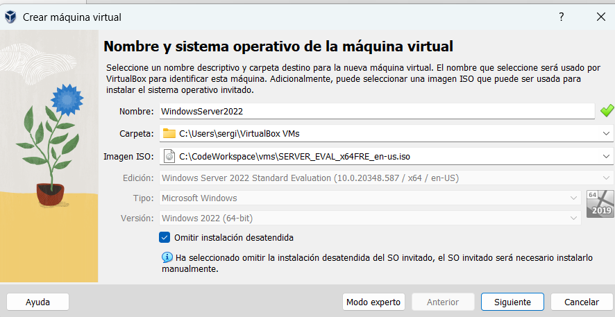
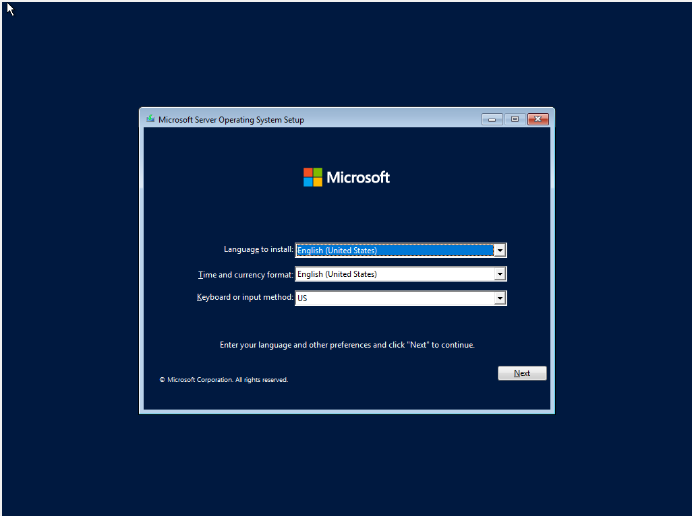
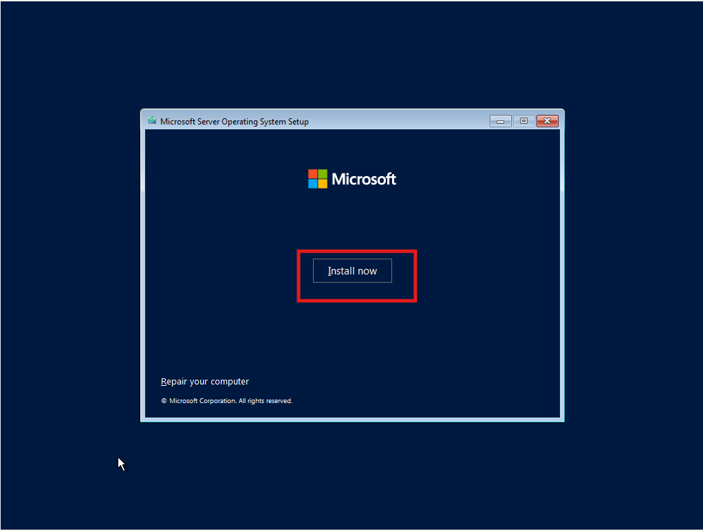
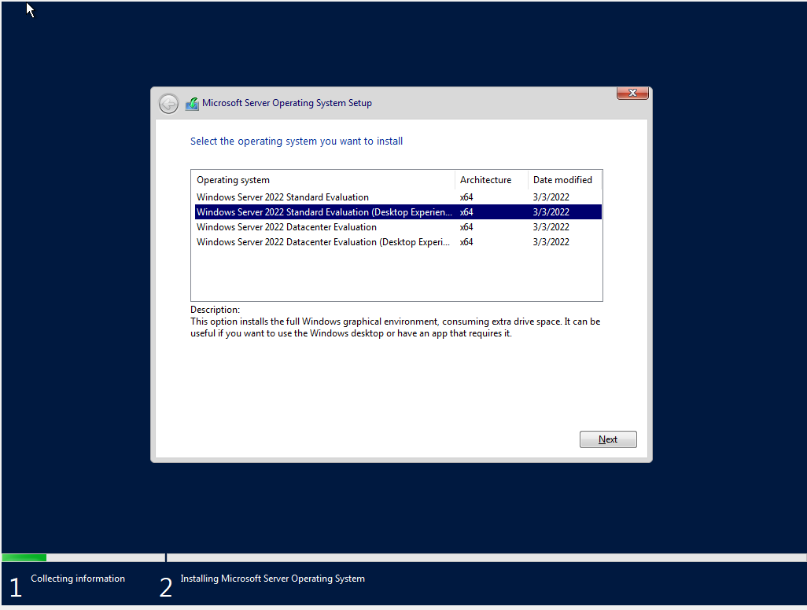
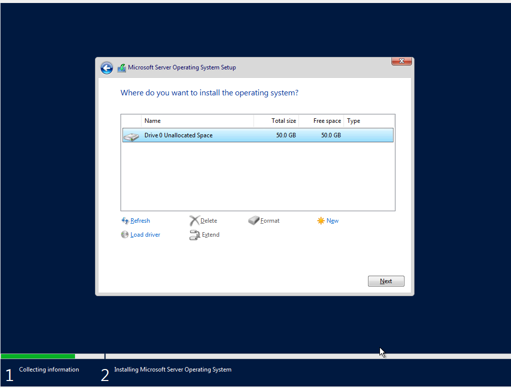
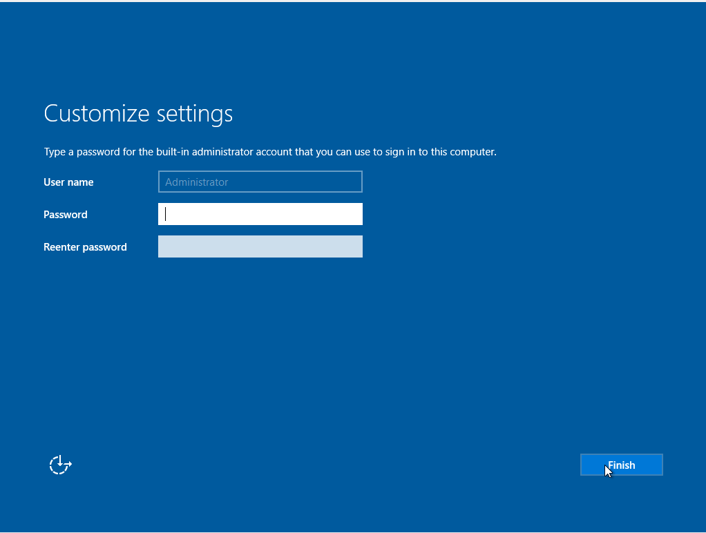
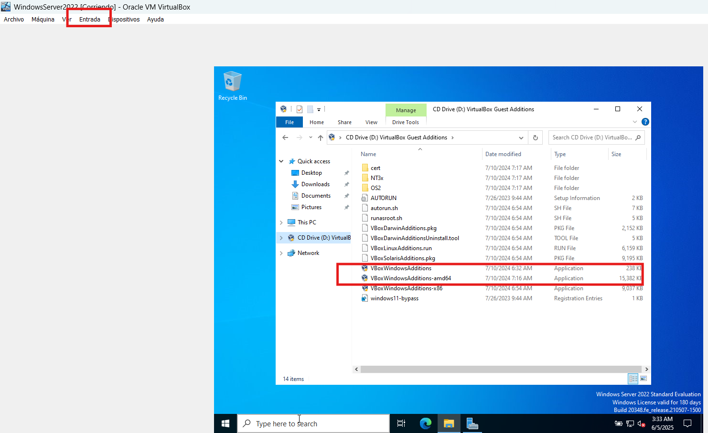
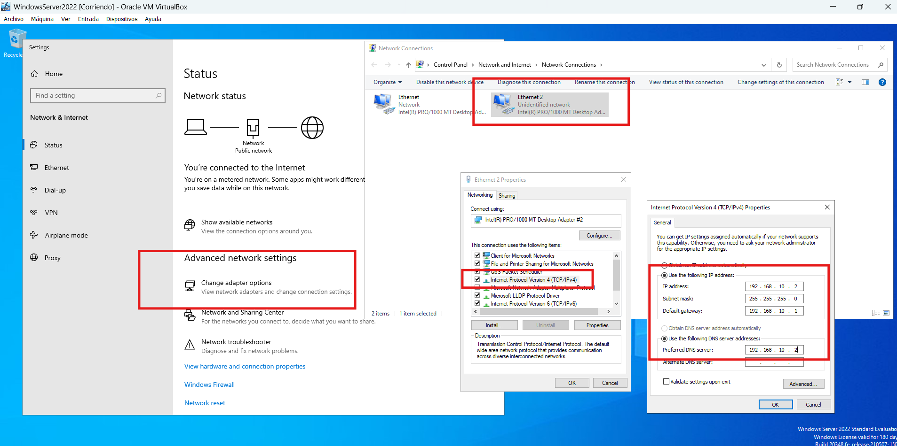
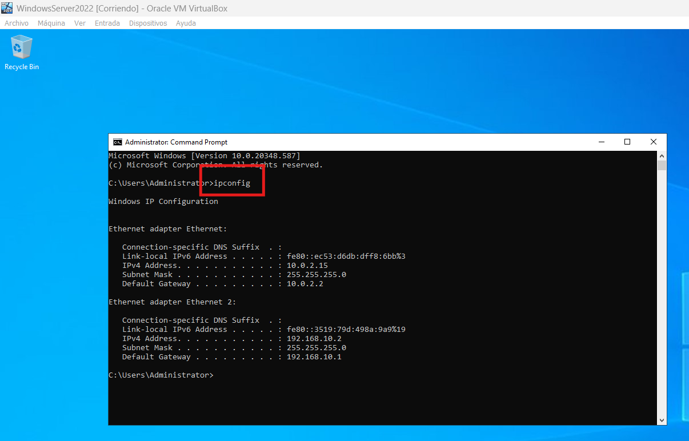

<h1 style="color:#0d47a1;">📘 Windows Server 2022 - Instalación y configuración básica de red</h1>

<strong>Fecha de creación:</strong> 04-06-2025 | <strong>Última modificación:</strong> 04-06-2025

---

## 🎯 Objetivo

  Realizar la instalación y configuración básica de red de un entorno basado en Windows Server 2022

---

## 🛠️ Tecnologías

- Windows Server 2022

---

## 📦 Dependencias

- Descarga del software. [Aquí](https://www.microsoft.com/es-es/evalcenter/download-windows-server-2022)
- Hipervisor Virtual Box 7 instalado. [Aquí](https://www.virtualbox.org/wiki/Downloads)

---

## 🖥️ Entorno

- <strong>Nombre:</strong> VirtualBox 7. 

---

## ▶️ Pasos

| #  | Paso       | Instrucciones       | Pantallazo    |
|----|------------|---------------------|---------------|
| 00 | Crear nueva máquina virtual   | Crear nueva máquina virtual configurada con al menos, 1CPU, 4 GB de RAM, y 50GB de disco. Seleccionar la ISO descargada de la página oficial de Microsoft  |    |
| 01 | Idioma   | Seleccionar idioma y presionar "Next"  |    |
| 02 | Instalar   | Presionar "Install now"  |    |
| 03 | Seleccionar versión y aceptar licencia   | Seleccionar "Standard with desktop experience". Tras esto, aceptar los términos de licencia.  |    |
| 04 | Instalación "Custom"    | Seleccionar "Custom installation", y presionar "next" en la pantlla de selección de disco para la instalación.  |    |
| 05 | Password    | Introducir password para el usuario Administrador y finalizar la instalación.  |    |
| 06 | Instalar Guess Additions    | En el menú de "Entrada" de VirtualBox seleccionar la imagen de GuessAdditions y ejecutar la instalación desde la unidad de CD del sistema operativo.  |    |
| 07 | Configurar la red    | En VirtualBox, en la configuración de red de la máquina virtual, seleccionar dos adaptadores de red. Uno para "NAT" (salida a internet), y otro de "Red interna", donde poder simular una LAN. Una vez hecho esto, en la configuración de los adaptadores de red de Windows Server, dejar el adaptador NAT con configuración automática por DHCP, y el adaptador de red interna con los parámetros deseados de manera manual. |    |

---

## ✅ Tests

| #  | Descripción       | Resultado esperado       | Pantallazo    |
|----|-------------------|--------------------------|---------------|
| 00 | Comprobar configuración de red   | Al abrir una terminal y ejecutar el comando "ipconfig" debe aparecer la configuración de red introducida  |    |

---

## 📚 Referencias

- 00 [Cómo instalar Windows Server 2022 en VirtualBox](https://www.youtube.com/watch?v=Wy1R-vxkqEc)

