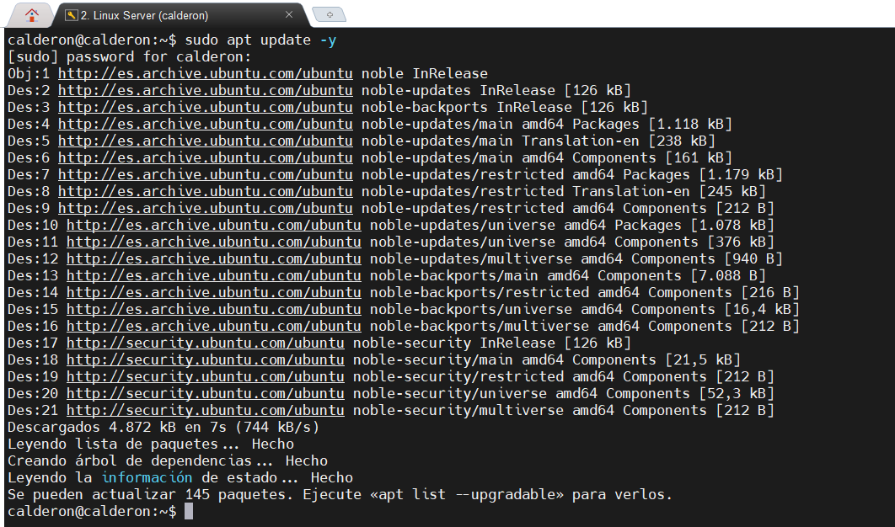
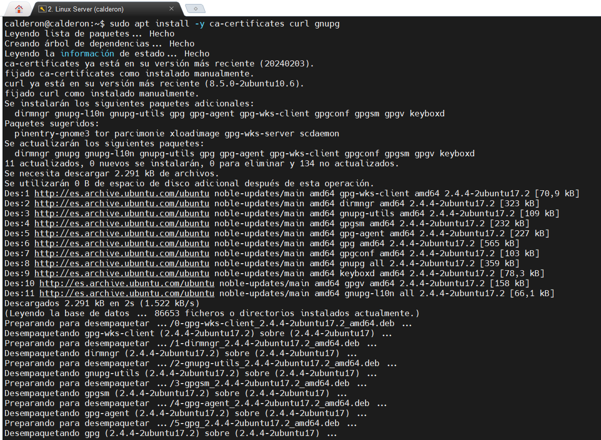
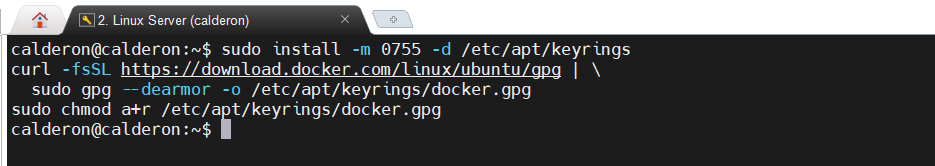
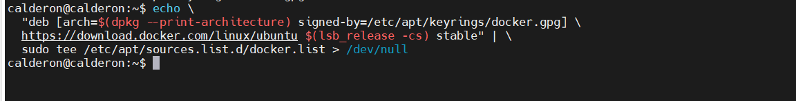
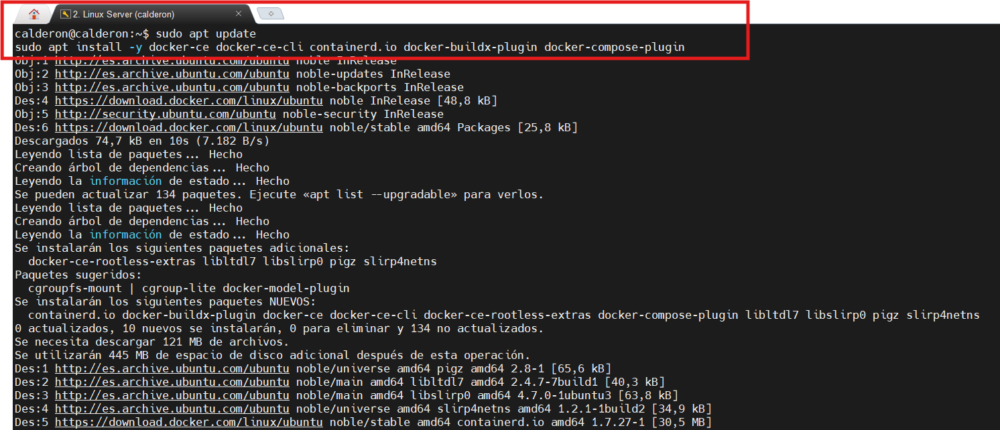
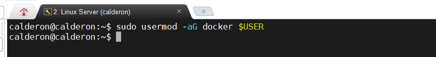
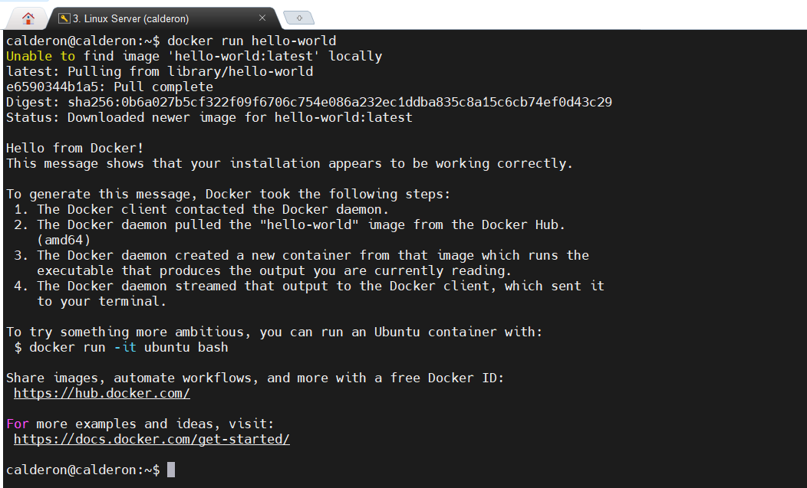
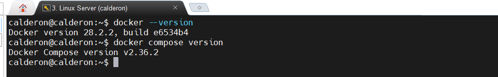

<h1 style="color:#0d47a1;">📘 Docker en Linux Server 24.04</h1>

<p><strong>Fecha de creación:</strong> 04-06-2025 | <strong>Última modificación:</strong> 04-06-2025</p>

---

## 🎯 Objetivo

<p style="color:#000000;">
  Realizar la instalación y configuración de la plataforma de gestión de contenedores Docker o en Linux Server 24.04
</p>

---

## 🛠️ Tecnologías

- Docker, Docker Compose, Linux Server 24.04

---

## 📦 Dependencias

- Instalación y configuración del sistema operativo Linux Server 24.04. [Aquí](../linux/00%20Linux%20Server2404.md)

---

## 🖥️ Entorno

- <strong>Nombre:</strong> Linux Server 24.04. 

---

## ▶️ Pasos

| #  | Paso       | Instrucciones       | Pantallazo    |
|----|------------|---------------------|---------------|
| 00 | Actualizar el sistema   | Ejecutar `sudo apt update -y` para actualizar el sistema con la última versión  |    |
| 01 | Instalar paquetes necesarios para la instalación   | Instalar en el sistema los siguientes paquetes que serán utilizados para realizar la descarga de Docker del repositorio oficial. `sudo apt install -y ca-certificates curl gnupg`  |    |
| 02 | Añadir la clave oficial de docker al gestor de paquetes   | Añadir la clave GPG oficial que se descarga con la herramienta "curl" en el gestor de paquetes "apt". <pre> sudo install -m 0755 -d /etc/apt/keyrings <br> curl -fsSL https://download.docker.com/linux/ubuntu/gpg | sudo gpg --dearmor -o /etc/apt/keyrings/docker.gpg <br> sudo chmod a+r /etc/apt/keyrings/docker.gpg </pre>|    |
| 03 | Añadir el repositorio al gestor de paquetes  | Añadir el repositorio oficial de Docker al gestor de paquetes "apt". <pre> echo "deb [arch=$(dpkg --print-architecture) signed-by=/etc/apt/keyrings/docker.gpg] https://download.docker.com/linux/ubuntu $(lsb_release -cs) stable" | sudo tee /etc/apt/sources.list.d/docker.list > /dev/null </pre>
|    |
| 04 | Actualizar paquetes e instalar Docker  | Actualizar de nuevo el sistema e instalar Docker con "apt" <pre> sudo apt update <br> sudo apt install -y docker-ce docker-ce-cli containerd.io docker-buildx-plugin docker-compose-plugin |  |
| 05 | Dar permisos al usuario  | Incluir al usuario actual dentro del grupo "docker" de manera que no sea necesario realizar "sudo" en cada operación. NO HACER EN ENTORNOS DE PRODUCCIÓN. `sudo usermod -aG docker $USER` |    |

---

## ✅ Tests

| #  | Descripción       | Resultado esperado       | Pantallazo    |
|----|-------------------|--------------------------|---------------|
| 00 | Comprobar la instalación  | Realizar la descarga y ejecución del contenedor de prueba "Hello World". Ejecutar: `sudo docker run hello-world`|    |
| 01 | Comprobar las versiones instaladas  | Comprobar las versiones de Docker y Docker Compose instaladas mediante el proceso anterior. Ejecutar los comandos: 
```
docker --version
docker compose version
```
Se deberían mostrar las versiones del software instaladas para ambos componentes.
|    |

---

## 📚 Referencias / Documentación

- 00 [How to install Docker on Ubuntu 24.04](https://www.youtube.com/watch?v=9D-HLjJeuFk)
- 01 [Documentación oficial de Docker](https://docs.docker.com/engine/install/ubuntu/)


