<h1 style="color:#0d47a1;">📘 Linux Server 2404 - Instalación y configuración básica de red</h1>

<strong>Fecha de creación:</strong> 04-06-2025 | <strong>Última modificación:</strong> 04-06-2025

---

## 🎯 Objetivo

  Realizar la instalación y configuración básica de red de un entorno basado en Linux Server 24.04

---

## 🛠️ Tecnologías

- Linux Server 24.04

---

## 📦 Dependencias

- Descarga del software. [Aquí](https://ubuntu.com/download/server)
- Hipervisor Virtual Box 7 instalado. [Aquí](https://www.virtualbox.org/wiki/Downloads)

---

## 🖥️ Entorno

- <strong>Nombre:</strong> VirtualBox 7. 

---

## ▶️ Pasos

| #  | Paso       | Instrucciones       | Pantallazo    |
|----|------------|---------------------|---------------|
| 00 | Crear nueva máquina virtual   | Crear nueva máquina virtual configurada con al menos, 1CPU, 4 GB de RAM, y 50GB de disco. Seleccionar la ISO descargada de la página oficial de Linux Ubuntu. IMPORTANTE - durante el proceso de instalación marcar el check "Habilitar EFI"  | 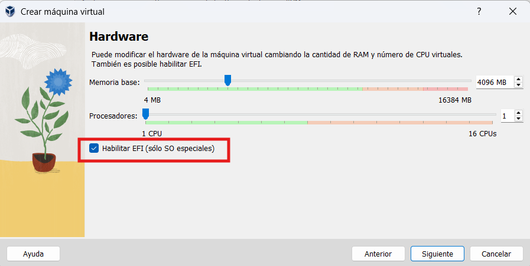   |
| 01 | Configurar la red    | En VirtualBox, en la configuración de red de la máquina virtual, seleccionar dos adaptadores de red. **Uno "NAT" (para tener salida a internet)**, y **otro de "Red interna", donde poder simular una LAN**. La configuración de los adaptadores de red se indicará a lo largo del proceso de instalación de Linux Server. Antes de iniciar la instalación, acceder a la sección de "Reenvío de puertos" dentro del adaptador NAT y realizar un mapeo del puerto anfitrión (host) 2222 con el puerto invitado (guest) 22. Esto permitirá que podamos acceder posteriormente por SSH desde un terminal del host, para mayor comodidad en la ejecución de los comandos.  | 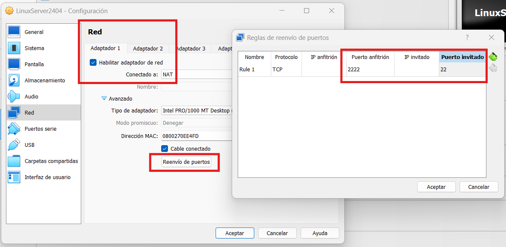   |
| 02 | Seleccionar idioma de la instalación    | El primer paso de la instalación será seleccionar un idioma para la instalación del sistema operativo. En este ejemplo, se selecciona "Español".  | 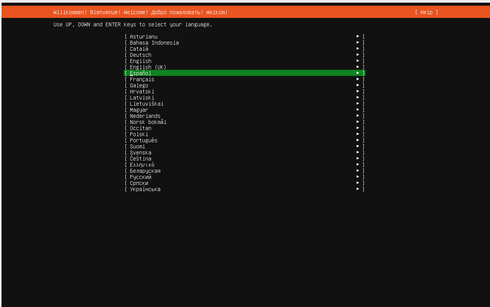   |
| 03 | Seleccionar idioma del teclado    | El proceso de instalación tratará de detectar un idioma para el teclado. En este caso "Spanish".  | 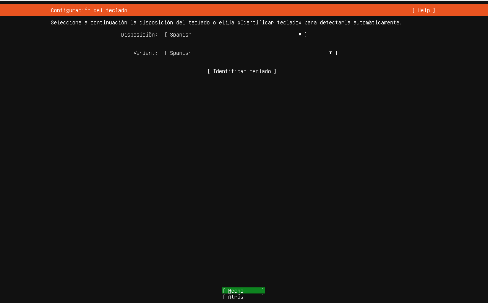   |
| 04 | Seleccionar el tipo de instalación    | Se selecciona "Ubuntu server" por defecto  | 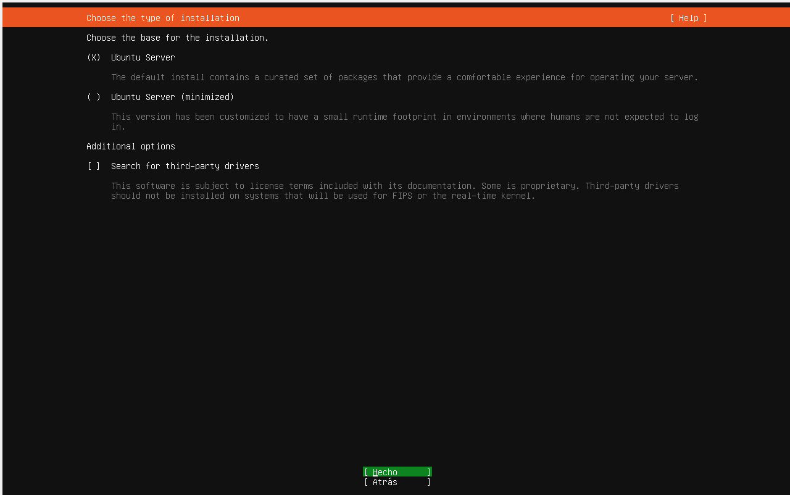   |
| 05 | Configuración de la red - parte I    | En este momento se inicia la configuración de los dos adaptadores de red. NAT (enp0s3) se configurará automáticamente con el DHCP de VirtualBox, asignando una IP que permita la navegación por internet. El adaptador de red interna (enp0s8), se configurará manualmente a continuación presionando "intro" sobre él.  | 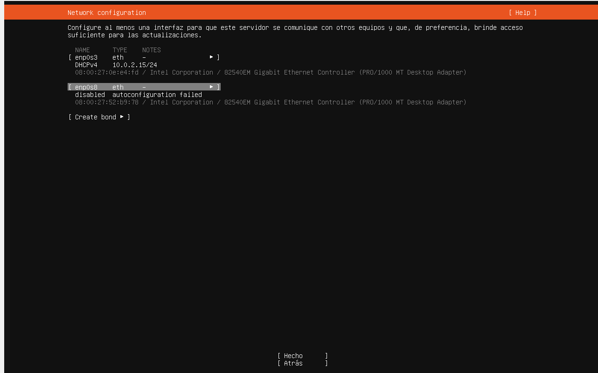   |
| 06 | Configuración de la red - parte II   | Dentro del adaptador de red interna (enp0s8), se configurará manualmente una IP fija de la subred que se desee para trabajar, su máscara de red y una IP para el servidor DNS. IMPORTANTE - En principio no hay que poner una IP de Gateway ya que se utilizará la del adaptador NAT para navegar. Si se configura en este punto una IP para el gateway, es posible que haya que cambiar las tablas de enrutamiento posteriormente si se desea conexión a internet | 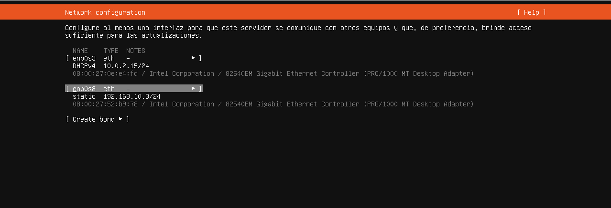   |
| 07 | Seleccionar el servidor "mirror" para la descarga de paquetes   | Seleccionar el servidor "mirror" por defecto | 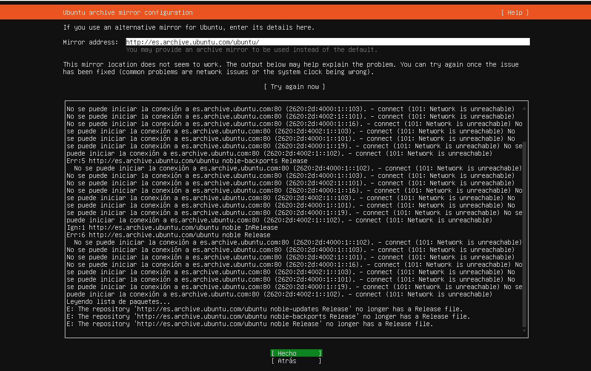   |
| 08 | Seleccionar el disco para la instalación   | Seleccionar la opción "use the entire disk" | 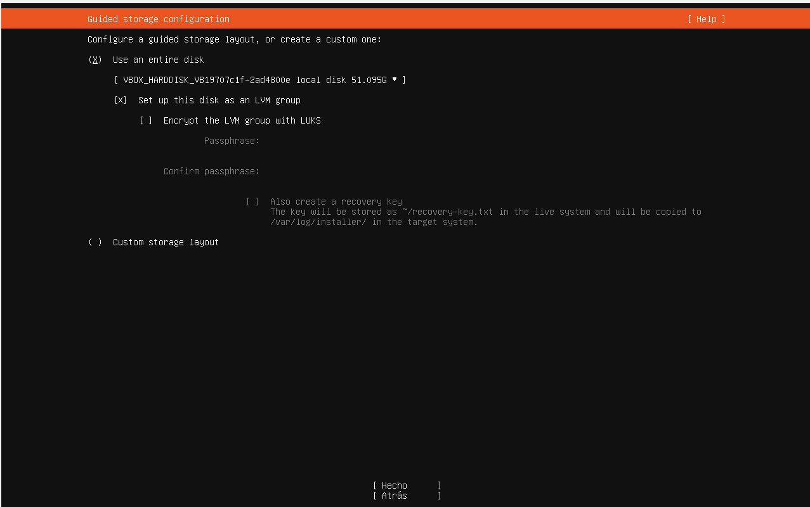   |
| 09 | Resumen del sistema de archivos de la instalación   | En esta pantalla se muestra un resumen de las particiones que se van a hacer en el sistema. Continuar con la instalación | 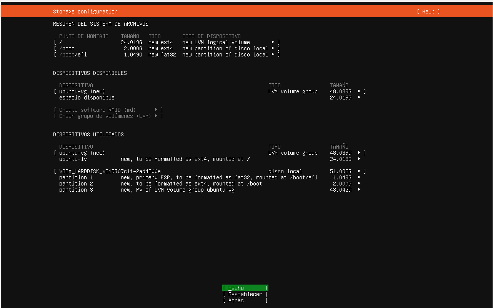   |
| 10 | Usuario y password | En este paso del proceso, se indica usuario y password así como el hostname del servidor.| 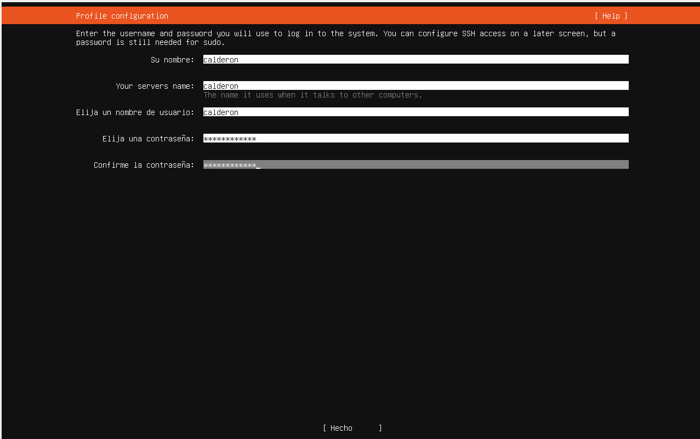   |
| 11 | Instalar "Ubuntu pro" | Ubuntu Pro es una versión ampliada y de pago de Ubuntu, ofrecida por Canonical, pensada especialmente para empresas. En este caso seleccionaremos "Skip ubuntu pro" |    |
| 12 | Configuración SSH | Seleccionar la opción de "Instalar servidor OpenSSH" de manera que permita posteriormente la conexión desde un terminal del host para lanzar los comando en "remoto". | 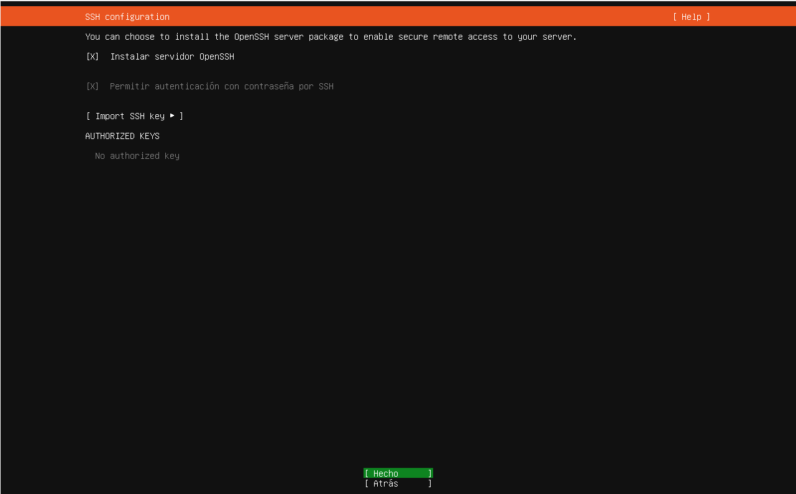   |
| 13 | Finalizar la instalación | Seleccionar "Reiniciar ahora" para finalizar la instalación. |    |

---

## ✅ Tests

| #  | Descripción       | Resultado esperado       | Pantallazo    |
|----|-------------------|--------------------------|---------------|
| 00 | Comprobar la conexión  | Desde un terminal del host (Putty, MobaXTerm...), realizar una conexión por SSH en el puerto 2222 con el usuario configurado durante la instalación. La conexión se hará hacia "localhost", ya que la máquina virtual está ejecutándose en el mismo PC. Ejemplo: `ssh -p 2222 calderon@localhost`. El usuario debe ser capaz de acceder al servidor en remoto.| 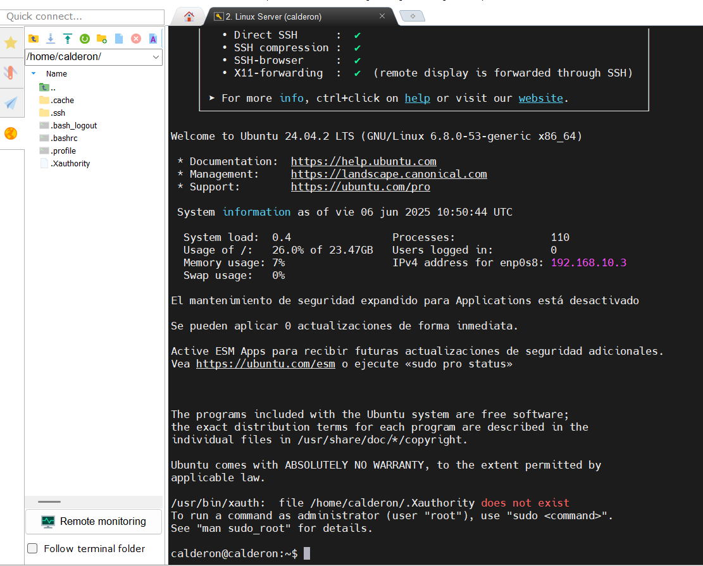   |
| 01 | Comprobar la configuración de la red  | Acceder al fichero de configuración de red en el directorio netplan. Ejemplo: `sudo nano /etc/netplan/50-cloud-init.yaml` La configuración debe reflejar los parámetros seleccionados durante la instalación|    |
| 02 | Comprobar la asignación correcta de configuración de red  | Ejecutar el comando: `ip a` para visualizar la configuración de red, la cual debe reflejar los parámetros seleccionados durante la instalación|    |
---

## 📚 Referencias / Documentación

- 00 [Cómo instalar Linux Server 24.04 en VirtualBox](https://www.youtube.com/watch?v=CSL0l1FETLw)

