<h1 style="color:#0d47a1;">📘 DHCP en Windows Server</h1>

<strong>Fecha de creación:</strong> 04-06-2025 | <strong>Última modificación:</strong> 04-06-2025

---

## 🎯 Objetivo

  Realizar la instalación y configuración básica de un servicio DHCP en Windows Server 2022

---

## 🛠️ Tecnologías

- Windows Server 2022
- Windows DHCP Server

---

## 📦 Dependencias

- Instalación y configuración del sistema operativo Windows Server 2022 [Aquí](../../01%20entornos/windows/00%20Windows%20Server%202022.md)
- Despliegue de una máquina con un sistema operativo de cliente (Windows o Linux), necesario para hacer las pruebas. Esta máquina tendrá que tener un adaptador de "Red Interna" en VirtualBox, con el mismo identificador de red interna que tiene el servidor, de manera que simulemos una conexión en red de ambas máquinas a través de un switch, como si estuvieran en la misma LAN.

---

## 🖥️ Entorno

- <strong>Nombre:</strong> [Windows Server 2022](../../01%20entornos/windows/00%20Windows%20Server%202022.md)

---

## ▶️ Pasos de instalación

| #  | Paso       | Instrucciones       | Pantallazo    |
|----|------------|---------------------|---------------|
| 00 | Abrir el **Server Manager**   | Abrir la herramienta de gestión del servidor y seleccionar la opción de **Add roles and features**   | 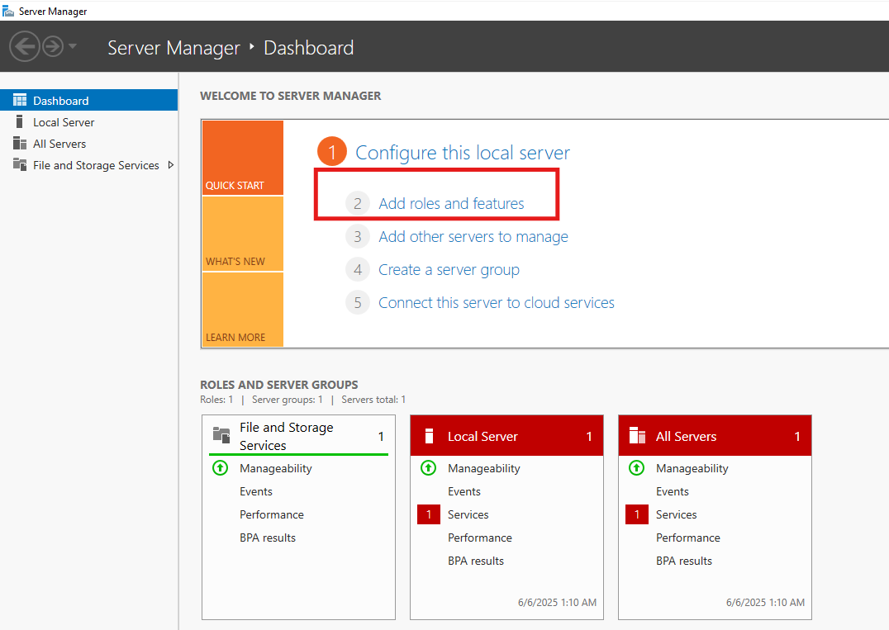   |
| 01 | Seleccionar el rol **DHCP Server**   | Continuar en el asistente hasta poder seleccionar el rol de **DHCP Server**   | 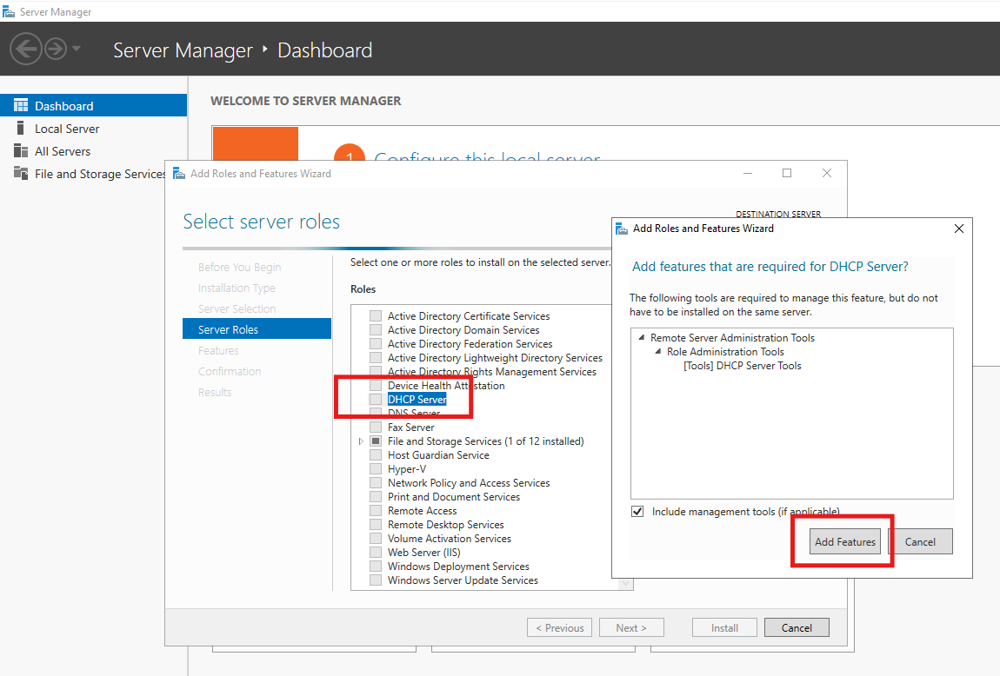   |
| 02 | Confirmar la instalación   | Continuar y confirmar la instalación pulsando en "Intall" para finalizar el asistente   | 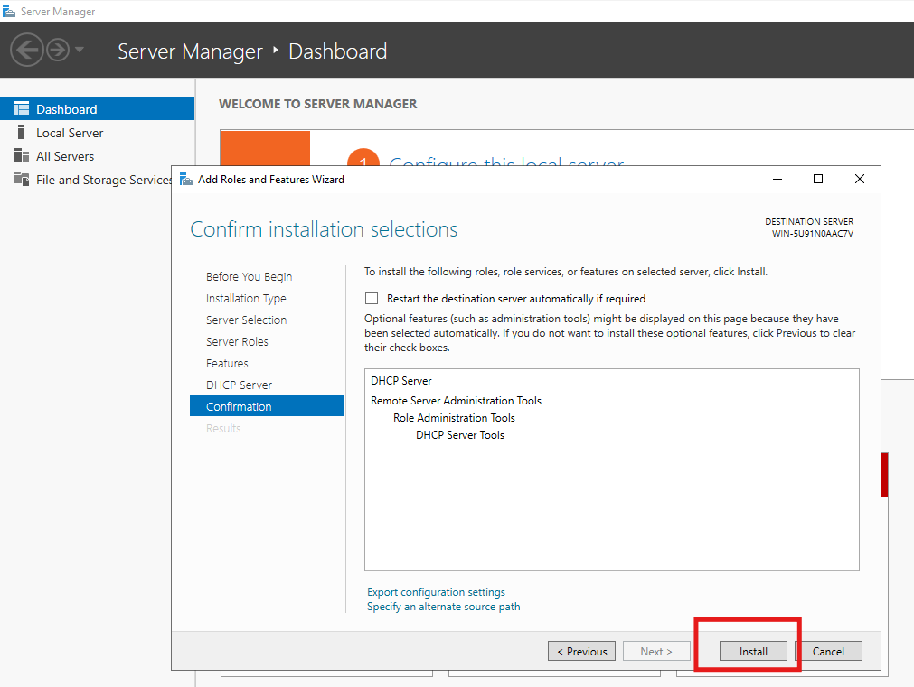   |
| 03 | Completar la instalación   | En el icono de la parte superior derecha de la ventana del Server Manager aparecerá un símbolo de advertencia (Triángulo amarillo con admiración). Hacer clic y de nuevo clic en **Complete DHCP configuration**   | 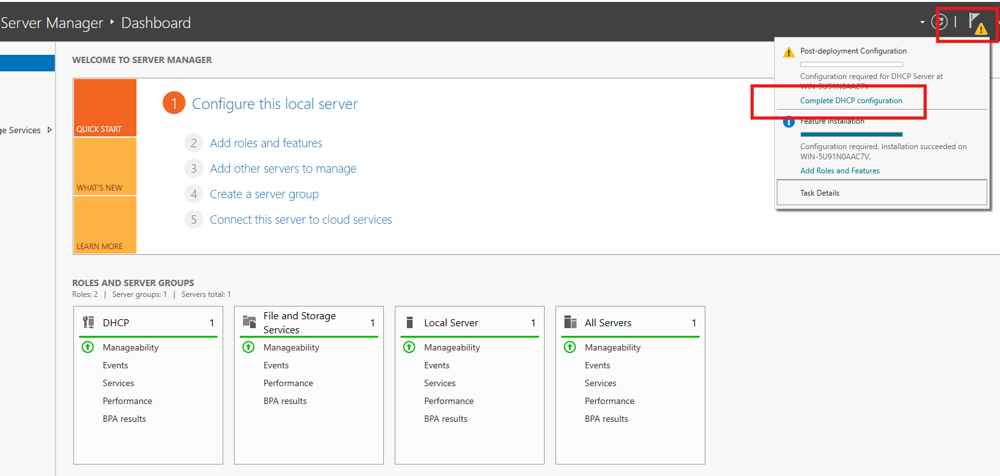   |
| 04 | Comprobar el servicio   | En la pantalla principal del Server Manager, ya debe poder observarse el rol de DHCP en color verde. Además, se puede comprobar que el servicio **DHCP Server** está levantado en la herramienta de servicios   | 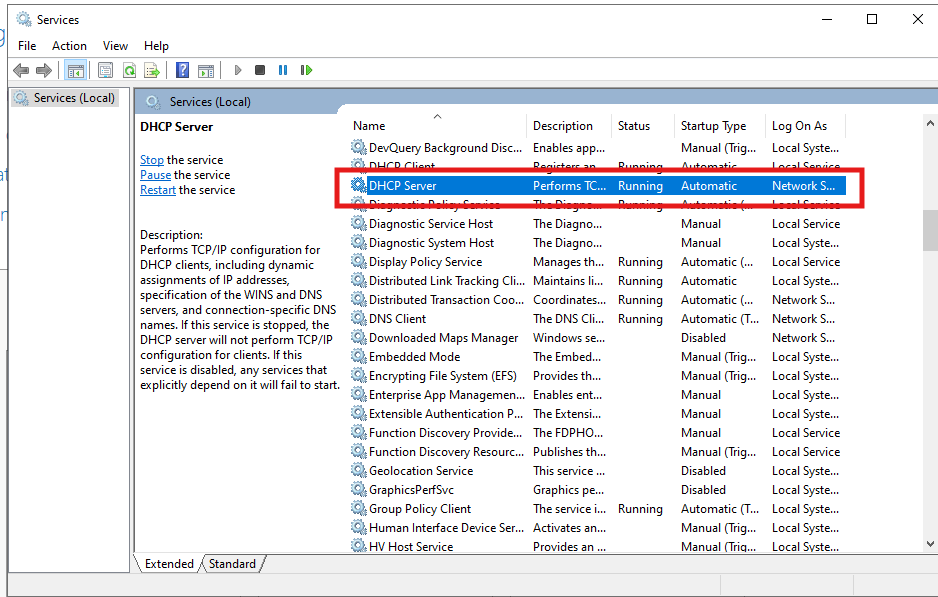   |

## ▶️ Pasos de configuración

| #  | Paso       | Instrucciones       | Pantallazo    |
|----|------------|---------------------|---------------|
| 00 | Administrar el DHCP   | Acceder a la herramienta de administración del DHCP en el servidor desde la sección de **tools** del menú en la parte superior derecha del Server Manager.  | 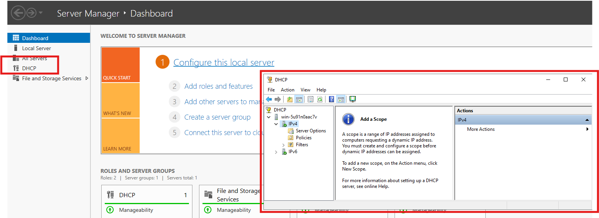   |
| 01 | Crear un nuevo ámbito   | Un ámbito es un conjunto de IPs y configuraciones que el servidor puede gestionar para una subred en concreto. Seleccionar el pool de IPv4 y mediante clic derecho seleccionar **new scope**  | 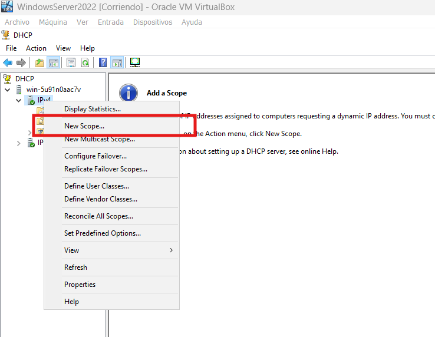   |
| 02 | Etiquetar el ámbito   | Cuando comienza el asistente, dar un nombre y una descripción al ámbito  | 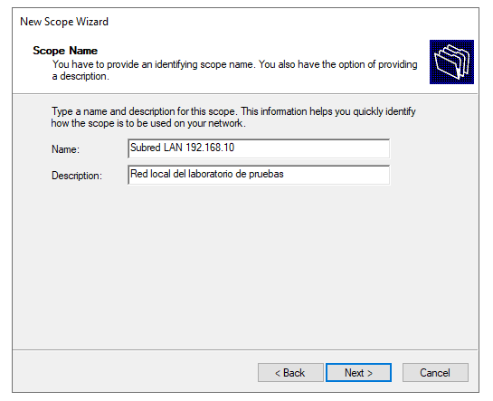   |
| 03 | Configurar el rango de IPs disponibles   | Indicar una dirección IP inicial y una dirección IP final. Esto establecerá el "pool" de direcciones disponibles para asignar a los clientes  | 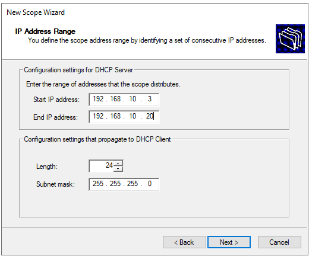   |
| 04 | Añadir exclusiones   | Indicar, si se desea, un rango de direcciones a excluir en las asignaciones. Por ejemplo, esto es útil si se desea evitar que ciertas direcciones IPs que han sido asignadas manualmente a servidores, formen parte del pool de direcciones disponibles para la asignación dinámica.  | 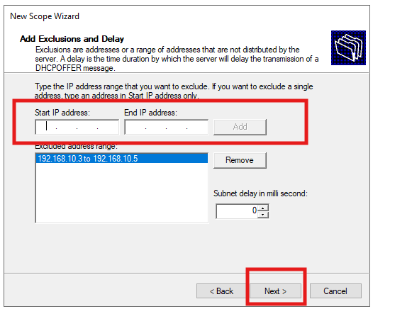   |
| 05 | Añadir exclusiones   | Configurar el tiempo de cesión durante el cuál un cliente tiene permitido utilizar una IP asignada del pool.  | 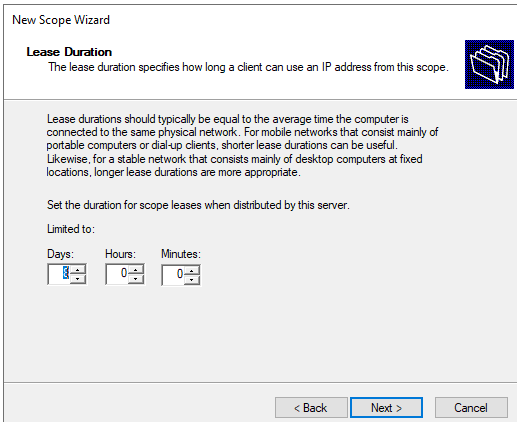   |
| 06 | Configuración de IP del Gateway   | En las opciones de configuración de red del ámbito se pueden configurar diversos parámetros de manera que estos sean fijados en los clientes que lo soliciten junto con la dirección IP. En un primer paso puede especificarse la IP de Gateway, para indicar la dirección IP de salida hacia el router. | 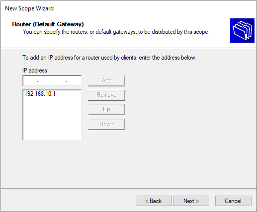   |
| 07 | Configuración de las IP del servidor DNS | En un segundo paso pueden especificarse una o varias IPs correspondientes con los servidores DNS a utilizar en los clientes durante el proceso de traducción de nombres de dominio. | 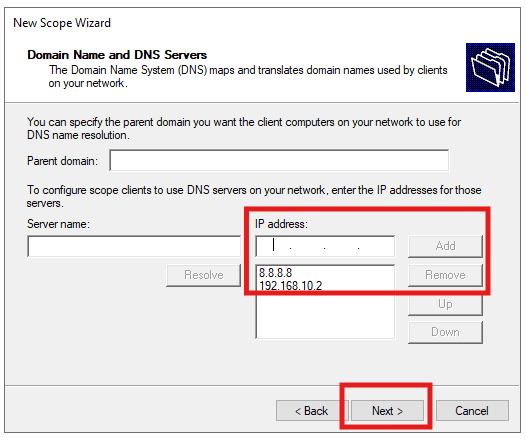   |
| 08 | Configuración de WINS server | Obsoleto o en desuso. Servicio de resolución de nombres NETBIOS en redes Windows antiguas. | 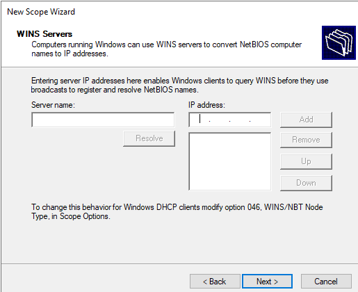   |
| 09 | Finalización de la creación del scope | Finalizar el asistente indicando "Yes. I want to activate this scope now". | 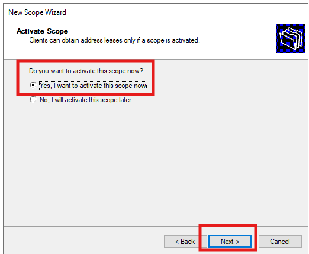   |
| 10 | Revisar y/o actualizar opciones de configuración del ámbito | Desplegando el "scope" creado, se puede navegar en el menú lateral izquierdo por las distintas opciones de configuración, pudiendo modificar los parámetros introducidos en el asistente si fuera necesario.  | 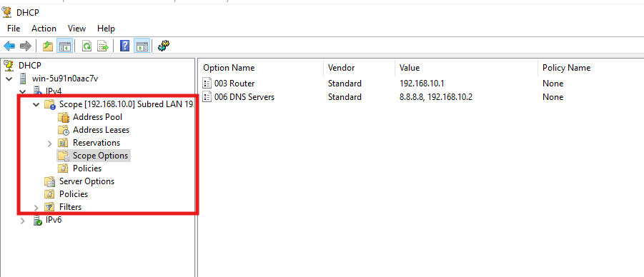   |

---

## ✅ Tests

| #  | Descripción       | Resultado esperado       | Pantallazo    |
|----|-------------------|--------------------------|---------------|
| 00 | Arrancar una máquina con un sistema operativo "cliente" y forzar la asignación dinámica de configuración de red. (Mediante DHCP)   | Al abrir un terminal (CMD en Windows o Bash en Linux) y ejecutar el comando adecuado, debe aparecer la configuración de red proporcionada por el servidor DHCP  `ipconfig ` en Windows o `ip a`en Linux.  |    |
| 01 | Comprobar la concesión realizada desde el servidor   | Desde la herramienta de administración del DHCP en el servidor, haciendo clic en la opción de concesiones de dirección "Address leases, debe aparecer la IP asignada al cliente.  | 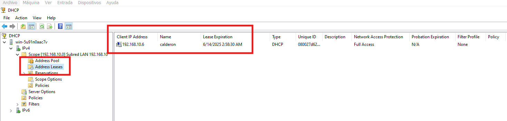   |

---

## 📚 Referencias

- [Solvetic - Instalar y configurar DHCP en Windows Server 2022](https://www.youtube.com/watch?v=G66IWWIfvVQ)

