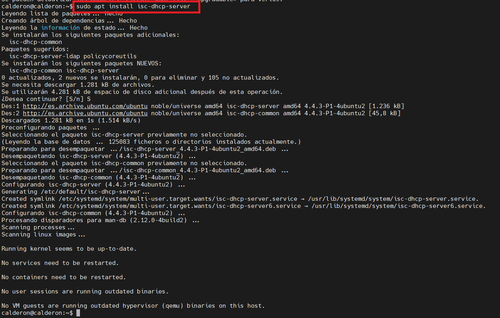
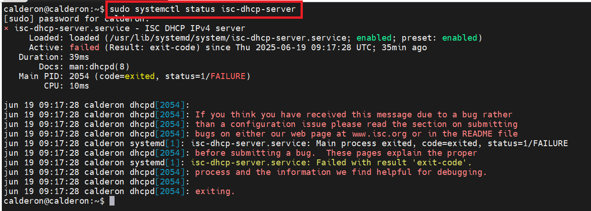
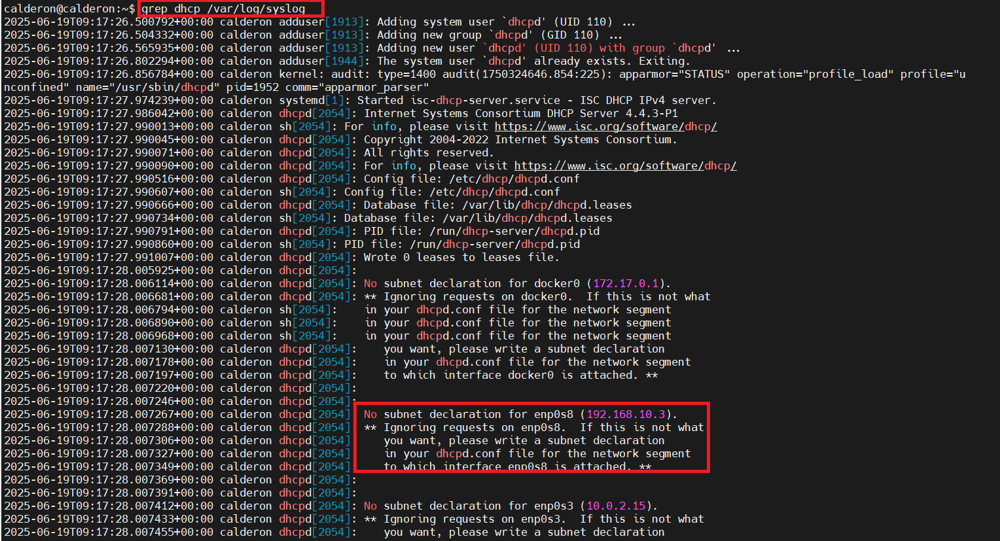
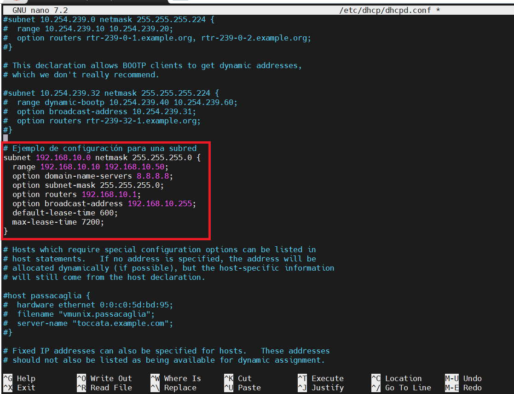
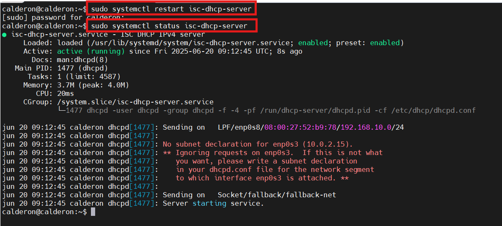
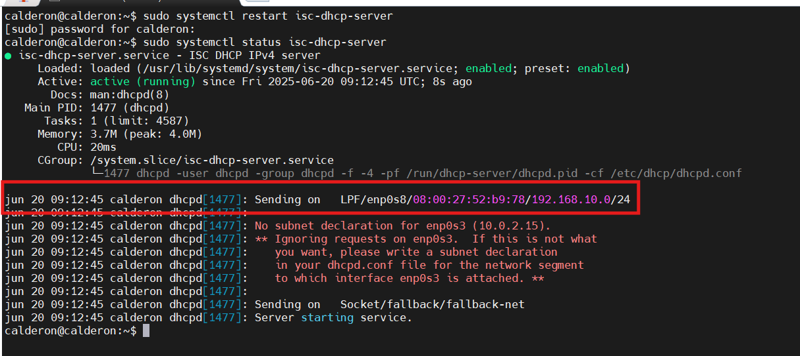
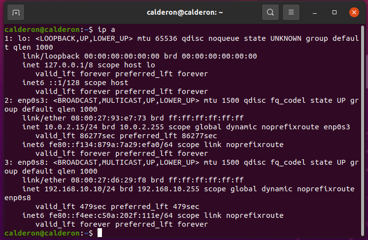
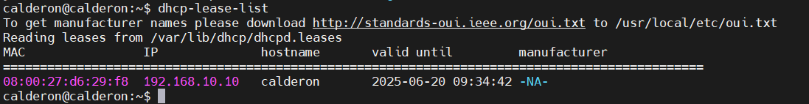

<h1 style="color:#0d47a1;">📘 DHCP en Linux Server</h1>

<strong>Fecha de creación:</strong> 04-06-2025 | <strong>Última modificación:</strong> 04-06-2025

---

## 🎯 Objetivo

  Realizar la instalación y configuración básica de un servicio DHCP en Linux Server 24.04

---

## 🛠️ Tecnologías

- Linux Server 24.04
- Linux ISC DHCP Server

---

## 📦 Dependencias

- Instalación y configuración del sistema operativo Linux Server 24.04 [Aquí](../../01%20entornos/linux/00%20Linux%20Server2404.md)
- Despliegue de una máquina con un sistema operativo de cliente (Windows o Linux), necesario para hacer las pruebas. Esta máquina tendrá que tener un adaptador de "Red Interna" en VirtualBox, con el mismo identificador de red interna que tiene el servidor, de manera que simulemos una conexión en red de ambas máquinas a través de un switch, como si estuvieran en la misma LAN.
- Instalación si fuera necesario de una herramienta **terminal** para la conexión remota con el servidor. Por ejemplo [MobaXterm](https://mobaxterm.mobatek.net/download.html) o incluso la propia terminal de Linux.

---

## 🖥️ Entorno

- <strong>Nombre:</strong> [Linux Server 24.04](../../01%20entornos/linux/00%20Linux%20Server2404.md)

---

## ▶️ Pasos

**Instalación**

| #  | Paso       | Instrucciones       | Pantallazo    |
|----|------------|---------------------|---------------|
| 00 | Conectar al servidor de Linux | Una vez iniciada la máquina de Linux Server conectar mediante un terminal utilizando para ello el comando SSH: `ssh -p 2222 usuario@localhost`   |     |
| 01 | Instalar el servicio **ISC DHCP Server**   | Para ello ejecutar el comando: `sudo apt update` y `sudo apt install isc-dhcp-server`  |    |
| 02 | Comprobar la instalación del servicio   | Para ello ejecutar el comando: `sudo systemctl status isc-dhcp-server`. El servicio aparecerá habilitado: **enabled**, pero NO activo: **Active: failed**  |    |
| 03 | Comprobar razón del fallo en la activación del servicio   | Mediante la búsqueda en los logs del sistema de la palabra "dhcp", se puede comprobar como la razón por la que el servicio no se ha activado es la **falta de configuración del interfaz de red por el que se desea comenzar a proporcionar los parámetros de configuración de red**: `sudo grep dhcp /var/log/syslog`. En el fichero **dhcpd.conf** pueden configurarse las distintas interfaces de red a las que puede estar conectado el servidor, y los parámetros que se servirán a los clientes que se conecten al servicio DHCP por esa interfaz  |    |

**Configuración**

| #  | Paso       | Instrucciones       | Pantallazo    |
|----|------------|---------------------|---------------|
| 04 | Configurar una subred | Acceder al fichero de configuración del dhcp mediante un editor de texto (Ejemplo: nano o vim) `sudo nano /etc/dhcp/dhcpd.conf` del menú en la parte superior derecha del Server Manager. A continuación se puede indicar valores de configuración para distintos parámetros de red, siendo los más básicos los que se explican en el siguiente código: [Ver código](./assets/code/00/configuracion_subred.md). La configuración debe realizarse conforme a alguna de las redes definidas en las interfaces de red del sistema operativo.  |    |
| 05 | Reiniciar el servicio y comprobar activación | Una vez realizados los cambios en la configuración, se reinicia el servicio DHCP mediante el comando: `sudo systemctl restart isc-dhcp-server`. Una vez reiniciado el servicio se comprueba que en esta ocasión sí que se encuentra activo, ya que al menos hay una subred válida configurada: `sudo systemctl status isc-dhcp-server` |    |
| 06 | Comprobar subred configurada | La salida del comando anterior mostrará como el servicio **dhcpd** está listo para enviar configuración de red a través de la interfaz "enp0s8" (red interna / LAN del servidor). Un poco más abajo se puede ver como muestra la advertencia de que no existe configuración para la subred de escucha en la interfaz "enp0s3" (red esterna / WAN del servidor)  |    |
---

## ✅ Tests

| #  | Descripción       | Resultado esperado       | Pantallazo    |
|----|-------------------|--------------------------|---------------|
| 00 | Arrancar una máquina con un sistema operativo "cliente" y forzar la asignación dinámica de configuración de red. (Mediante DHCP)   | Al abrir un terminal (CMD en Windows o Bash en Linux) y ejecutar el comando adecuado, debe aparecer la configuración de red proporcionada por el servidor DHCP  `ipconfig ` en Windows o `ip a` en Linux.  |    |
| 01 | Comprobar la concesión realizada desde el servidor   | Desde el comando `dhcp-lease-list`  |    |

---

## 📚 Referencias

- [ISC - Internet Systems Consortium - DHCP](https://www.isc.org/dhcp/)
- [Instalación de ISC en Ubuntu server 24.04](https://www.youtube.com/watch?v=SaXUV3QptKc)

