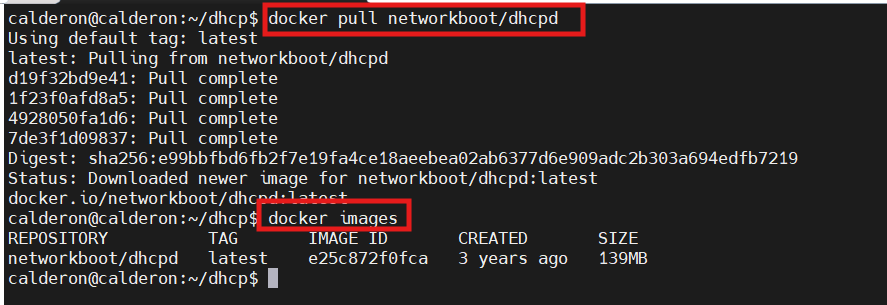
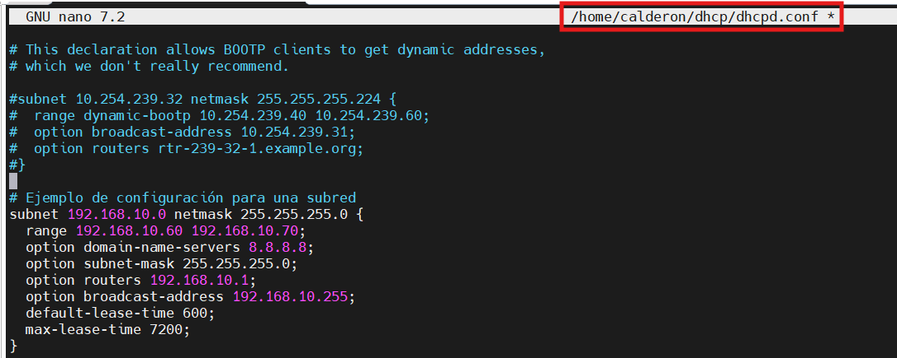
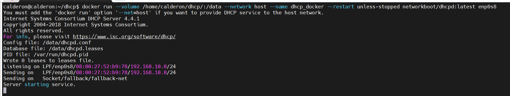
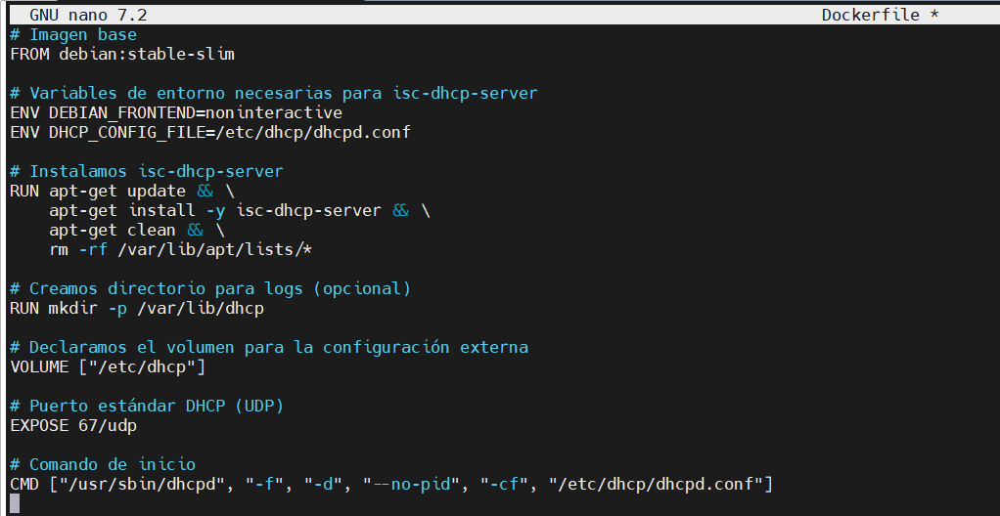
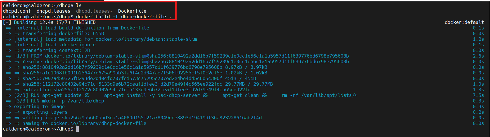
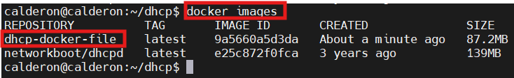
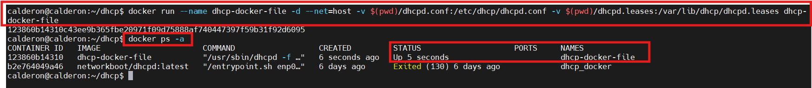
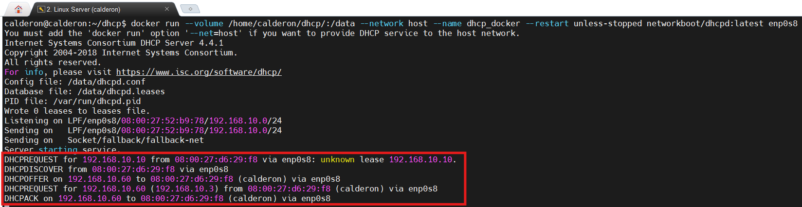
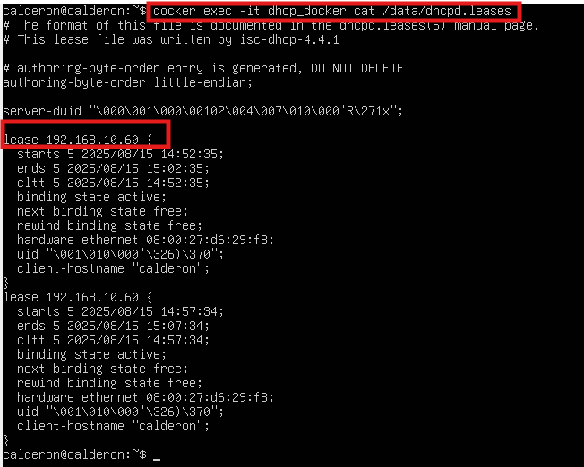
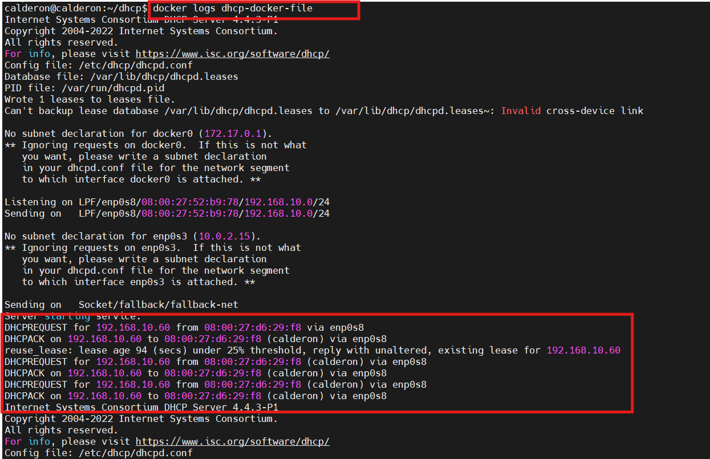

<h1 style="color:#0d47a1;">📘 DHCP en Docker</h1>

<strong>Fecha de creación:</strong> 26-07-2025 | <strong>Última modificación:</strong> 26-07-2025

---

## 🎯 Objetivo

  Realizar la instalación y configuración básica de un servicio DHCP en un contenedor Docker

---

## 🛠️ Tecnologías

- Linux Server 24.04
- Linux ISC DHCP Server
- Docker

---

## 📦 Dependencias

- Instalación y configuración del sistema operativo Linux Server 24.04 [Aquí](../../01%20entornos/linux/00%20Linux%20Server2404.md)
- Instalación y configuración del motor de contenedores Docker [Aquí](../../01%20entornos/contenedores/00%20Docker.md)
- Despliegue de una máquina con un sistema operativo de cliente (Windows o Linux), necesario para hacer las pruebas. Esta máquina tendrá que tener un adaptador de "Red Interna" en VirtualBox, con el mismo identificador de red interna que tiene el servidor, de manera que simulemos una conexión en red de ambas máquinas a través de un switch, como si estuvieran en la misma LAN.
- Instalación si fuera necesario de una herramienta **terminal** para la conexión remota con el servidor. Por ejemplo [MobaXterm](https://mobaxterm.mobatek.net/download.html) o incluso la propia terminal de Linux.

---

## 🖥️ Entorno

- <strong>Nombre:</strong> [Docker](../../01%20entornos/contenedores/00%20Docker.md)

---

## ▶️ Pasos de instalación

| #  | Paso       | Instrucciones       | Pantallazo    |
|----|------------|---------------------|---------------|
| 00 | Conectar al servidor de Linux | Una vez iniciada la máquina de Linux Server conectar mediante un terminal utilizando para ello el comando SSH: `ssh -p 2222 usuario@localhost`. **IMPORTANTE** - Si se ha instalado previamente el servicio dhcp en Linux, parar y deshabilitar dicho servicio para para que no interfiera con el nuevo servicio que se va a levantar en Docker: `sudo systemctl stop isc-dhcp-server.service` y `sudo systemctl disable isc-dhcp-server.service`   |     |
| 01 | Opción 1 - Descargar y arrancar imagen con **ISC DHCP Server**   | Para ello se pueden utilizar imágenes ya pre-construidas como por ejemplo: `networkboot/dhcpd` o `sw4iot/isc-dhcp`. Mediante el siguiente comando se realizará la descarga de la imagen: `docker pull networkboot/dhcpd` y con el comando: `docker images` se comprueba que la imagen se ha descargado correctamente y existe en el repositorio.  |    |
| 02 | Opción 1 - Crear fichero de configuración **dhcpd.conf**   | Crear un nuevo directorio para guardar la configuración, por ejemplo, uno llamado "dhcp" dentro del directorio home del usuario `mkdir ./dchp`. En este directorio, crear un fichero de configuración tal y como se explica más adelante en la sección de [configuración](#️-pasos-de-configuración) |    |
| 02 | Opción 1 - Arrancar el contenedor   | Arrancar un contenedor a partir de la imagen descargada mediante el siguiente comando: `docker run --volume /home/calderon/dhcp/:/data --network host --name dhcp_docker --restart unless-stopped networkboot/dhcpd:latest enp0s8` |    |
| 03 | Opción 2- Crear un Docker file para la construir una imagen a medida de **ISC DHCP Server** | Se puede utilizar el siguiente [DockerFile](./assets/code/02/dockerfile_iscdhcp.md) en una ruta determinada. Editar un fichero llamado **Dockerfile** y copiar el contenido que se encuentra y se explica en el enlace anterior |    |
| 04 | Opción 2- Ejecutar la creación de la imagen a partir del Dockerfile   | Construir la imagen mediante el comando: `docker build -t dhcp-docker-file .` A este comando se le da el nombre que queremos para la imagen y con el punto "." se indica que el fichero Dockerfile se encuentra en el mismo path en el que estás posicionado. Debes moverte al path del fichero para que el comando funcione.  |    |
| 05 | Opción 2- Comprobar la imagen creada   | Construir la imagen mediante el comando: `docker images` La nueva imagen creada a partir del Dockerfile debe aparecer en el repositorio local.  |    |
| 06 | Opción 2- Ejecutar el comando de creación del contenedor a partir de la nueva imagen   | Arrancar el contenedor mediante el comando: `docker run --name dhcp-docker-file -d --net=host -v $(pwd)/dhcpd.conf:/etc/dhcp/dhcpd.conf -v $(pwd)/dhcpd.leases:/var/lib/dhcp/dhcpd.leases dhcp-docker-file`. El parámetro **--net=host** es obligatorio para que el servidor DHCP escuche en la interfaz física del host y reciba broadcast. Además, el fichero **dhcpd.conf** debe existir en el host antes de arrancar. Comprobar que el contenedor se ha arrancado correctamente mediante el comando `docker ps -a`  |    |

## ▶️ Pasos de configuración

| #  | Paso       | Instrucciones       | Pantallazo    |
|----|------------|---------------------|---------------|
| 00 | Configurar una subred | Acceder al fichero de configuración del dhcp mediante un editor de texto (Ejemplo: nano o vim) `sudo nano ./dhcp/dhcpd.conf` del menú en la parte superior derecha del Server Manager. A continuación se puede indicar valores de configuración para distintos parámetros de red, siendo los más básicos los que se explican en el siguiente código: [Ver código](./assets/code/00/configuracion_subred.md). La configuración debe realizarse conforme a alguna de las redes definidas en las interfaces de red del sistema operativo. Una vez realizados los cambios de configuración es importante proceder al reinicio del contenedor para que dichos cambios tengan efecto. Esto puede hacerse mediante el comando: `docker restart nombre_del_contenedor`  |    |

---

## ✅ Tests

| #  | Descripción       | Resultado esperado       | Pantallazo    |
|----|-------------------|--------------------------|---------------|
| 00 | Arrancar una máquina con un sistema operativo "cliente" y forzar la asignación dinámica de configuración de red. (Mediante DHCP)   | Al abrir un terminal (CMD en Windows o Bash en Linux) y ejecutar el comando adecuado, debe aparecer la configuración de red proporcionada por el servidor DHCP  `ipconfig ` en Windows o `ip a` en Linux.  |    |
| 01 | Para el contenedor de la imagen **networkboot/dhcpd**:  | Comprobar la concesión realizada chequeado la salida por consola del contenedor |    |
| 02 | Para el contenedor de la imagen **networkboot/dhcpd**:  | Comprobar la concesión realizada desde el servidor en el fichero **dhcpd.leases** mediante el comando `docker exec -it dhcp_docker cat /data/dhcpd.leases`  |    |
| 03 | Para el contenedor de la imagen creada a medida con el **DockerFile**:  | Comprobar la concesión realizada desde el servidor chequeando los logs del contenedor mediante el comando `docker logs dhcp-docker-file`  |    |

---

## 📚 Referencias

- [NetworkBoot.org repositorio con Docker dhcpd](https://github.com/networkboot/docker-dhcpd)
- [Servicio DHCP con Docker](https://www.youtube.com/watch?v=eokbp2M-da4)
- [Imagen en DockerHub: sw4iot/isc-dhcp ](https://hub.docker.com/r/sw4iot/isc-dhcp)

